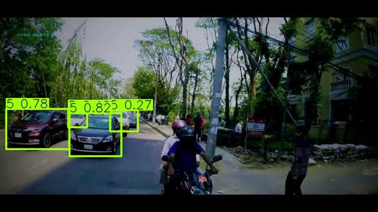
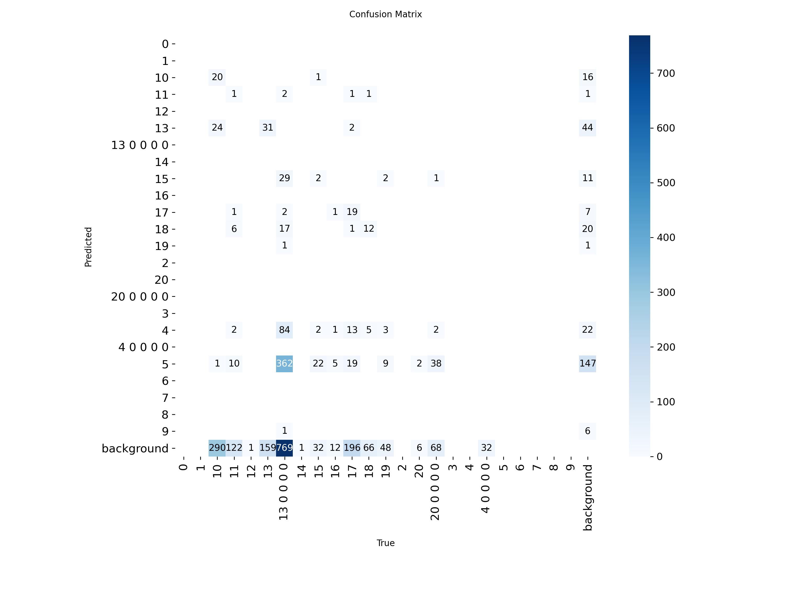
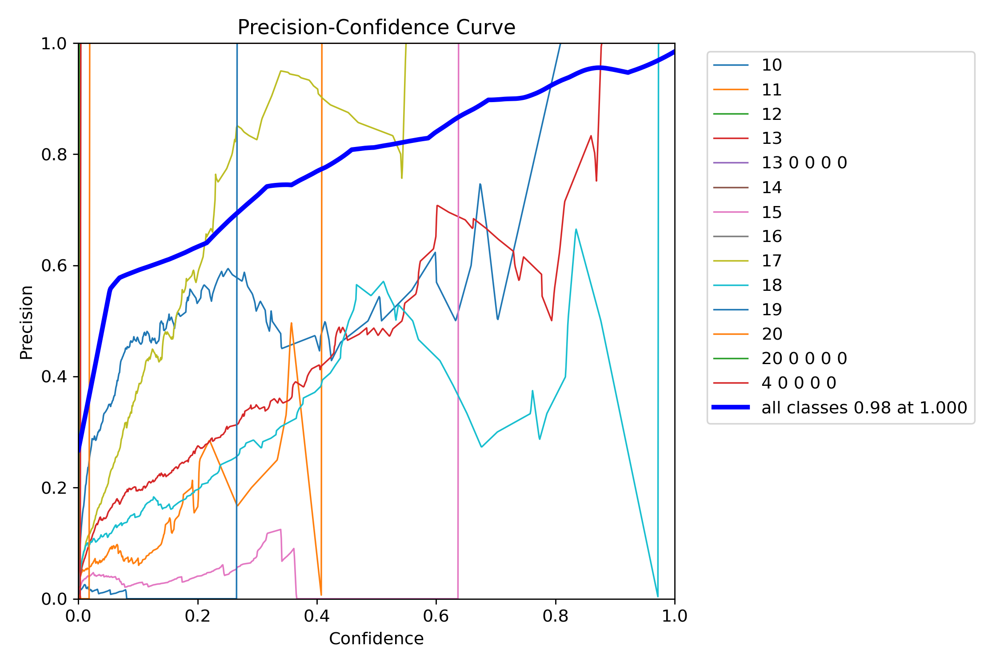
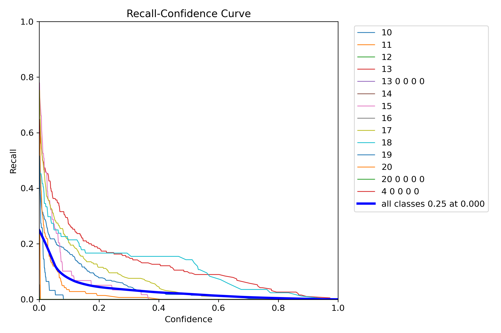

# Image Dataset Annotation & Object Detection System

## Project Overview
This project implements a complete image annotation and YOLOv8-based object detection pipeline for vehicle detection applications.

The workflow includes:
- Dataset preprocessing
- Image augmentation
- Annotation validation using CVAT
- YOLOv8 model training
- Inference benchmarking
- Prediction visualization
- Performance evaluation

---

## Tools & Technologies
- Python
- YOLOv8 (Ultralytics)
- OpenCV
- NumPy
- CVAT
- Git & GitHub

---

## Features
- Automated dataset preprocessing and validation
- Image augmentation using OpenCV
- Object detection model training using YOLOv8
- Benchmarking using inference-time metrics
- Bounding-box annotation workflow using CVAT
- Prediction visualization and evaluation plots

---

## Project Structure

```text
scripts/
results/
docs/
README.md
requirements.txt
data.yaml
```

---

## Example Results
Prediction outputs and evaluation plots are available in the `results/` folder.

### Evaluation Metrics

#### Confusion Matrix


#### Precision Curve


#### Recall Curve


---

## Future Improvements
- Real-time webcam detection
- Video object detection
- Docker containerization
- ROS2 integration
- Advanced hyperparameter tuning